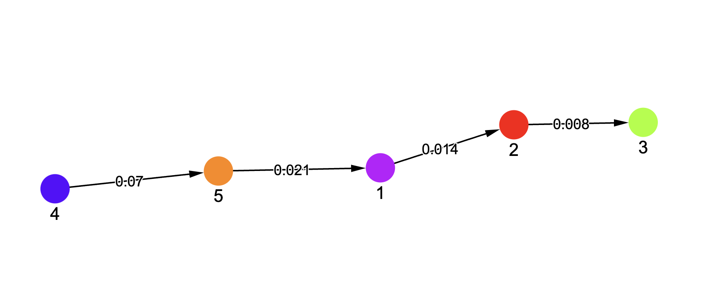

## Getting Started



While training a Neural Network, often our approach is just focused on the end output of the model. Thinking about the stages a model goes through during training is seldom our approach when we think of analyzing the model performance or behaviour in a certain situation.

Our effort is to bring a change in that approach and offer a deep dive into those stages and above figure is a sneak peek into that. It shows the stages a neural network goes through during the training process.

These stages can sometimes be referred to as `Phases` as well as `Latent States` and they can be defined as a state where the characteristics of the model are broadly falling under one consistent definition. For ex: A model can sometimes go through three stages like:

1. Model is memorizing the Training Data (indicated by increase in training accuracy)
2. Model has memorized the training data but doesn't generalize well (Good training accuracy but bad accuracy on validation data)
3. Model is able to generalize well on unseen data as well. (Good accuracy on both training and validation data)

Transition between `Latent States` is often a result of sudden changes or inflection points in one or more defining metrics of the model performance. A sequence of these transitions is termed as a `Generalization Strategy` or `Training Dynamics` or a `Trajectory`

Our package here, offers a solution for analyzing and visualizing Training Dynamics for a deeper analysis of generalization strategies adopted by Neural Networks.

<!-- We recommend to start with the [main demo]() to learn how the library works and how to use its features. -->

Motivation behind this library is to act as a one stop solution for research on Training Dynamics of Neural Networks, which is one of the most important topics in AI Interpretability.

This library is heavily insipired by the early work done by [Michael Hu](https://michahu.github.io/) for the paper [Latent State Models of Training Dynamics](https://arxiv.org/abs/2308.09543).

### Installation

```
pip install visualizing-training
```

Import the library using

```
import visualize_training
```

### Key Features

Key features include:

- Flexibility to define your own Neural Network architecture (currently it supports Transformer, MLPs, Resnet, LeNet5)
- Add custom hookpoints to collect data at different stages of the architecture
- Calculation of select metrics on the data collected
- Latent State predictions using [Hidden Markov Models (HMM)](https://en.wikipedia.org/wiki/Hidden_Markov_model) to analyze the Training Dynamics
- Interactive Visualization of Training Dynamics & Generalization Strategies in the form of network graphs and line charts.
