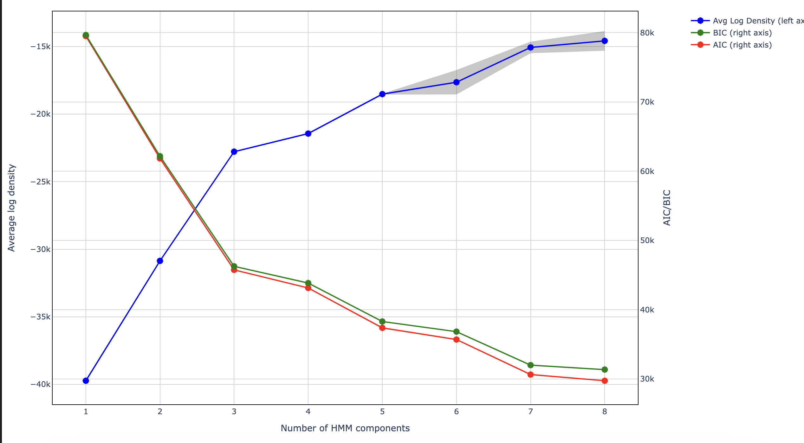
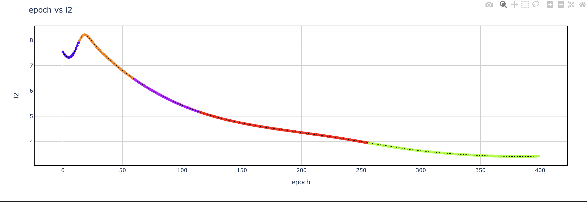

# Step By Step Guide

## Basics

Starting with some foundational concepts to begin with

### Latent States

Latent states can be defined as a state where the characteristics of the model are broadly falling under one consistent definition. For ex: A model can sometimes go through three stages like:

1. Model is memorizing the Training Data (indicated by increase in training accuracy)
2. Model has memorized the training data but doesn't generalize well (Good training accuracy but bad accuracy on validation data)
3. Model is able to generalize well on unseen data as well. (Good accuracy on both training and validation data)

They are sometimes referred to as `Phases` as well.

### Training Dynamics

Training Dynamics are defined as transition from one `Latent State` to another and is often a result of sudden changes or inflection points in one or more defining metrics of the model performance. A sequence of these transitions is termed as a `Generalization Strategy` or a `Trajectory` as well.

### Hidden Markov Models (HMM)

HMMs are probabilistic graphical models that allow us to predict a sequence of latent (or hidden states) from a set of observable features. They help us in predicting sequence of unknown variables whose outcome is dependent on the sequence of known observations in a known way.

The reason we use HMM is because we can represent training of a neural network as a stochastic process of transitions between `Latent States` which can provide us an overview of the significant changes during the training process.

Read more on HMM [here](./resources.md#hidden-markov-models)

### Hook points

Hooks allows the users to attach custom functions to tensors at specified locations within the neural network. They are executed when either a forward or backward pass of the [`Autograd.Function`](https://pytorch.org/docs/stable/autograd.html) object is called.

In our case, the custom function caches the weights and biases at the specified hook point which are used to calculate [metrics](./metrics.md) for training the HMM model.

### Core Approach

The core idea in our approach for Training Dynamics research is studying the [latent states](./step_by_step.md#latent-states) which can help us draw insights about the [training dynamics](./step_by_step.md#training-dynamics) a model is following for choosing different generalization strategies.

We believe that parameters (weights and biases) a Neural Network is encountering during the training process encode information about these latent states, and calculating metrics on top of these parameters can facilitate that process for us.

We collect a handpicked selection of 20 [metrics](./metrics.md) from these parameters using which we can do further analysis. User has the flexibility to specify hook points based on their requirements and these metrics will be calculated for those specific hookpoints and stored, which can be proccessed into preparing our training data for HMM.

## Visualization Module

To accompany with the analysis of HMM, we are introducing an interactive visualization module which can assist throughout the whole process, from model selection, training dynamics analysis to visualizing state transitions for any metric of interest.

### Model Selection

One of the methods in our Visualization module can help with selection of no of components for our HMM model. In the paper we have used lowest BIC as a criteria for component selection but other selection criterias can be used too. Figure below shows how a sample model selection graph looks like.

### Training Dynamics Analysis

To help with the analysis of Training Dynamics, we introduce a network graph visualization where you can interact with the different latent states a model is going through, study the transitions and hover over to see which features are contributing to that transition. A typical network graph can look as show below where the initial state is tagged as `4` and then the model transitions through different latent states terminating at `3`.

**Note:** Please treat the numbers as labels. They don't have any underlying meaning associated with them.

### Metrics vs Epochs

For assisting with getting a deeper insight w.r.t various metrics and phase transitions, our module plotting loss curvers can assist with it.

User can plot any metric available in the training data against epochs and monitor the phase transitions to get a better understanding of why a certain phase transition occurred.

